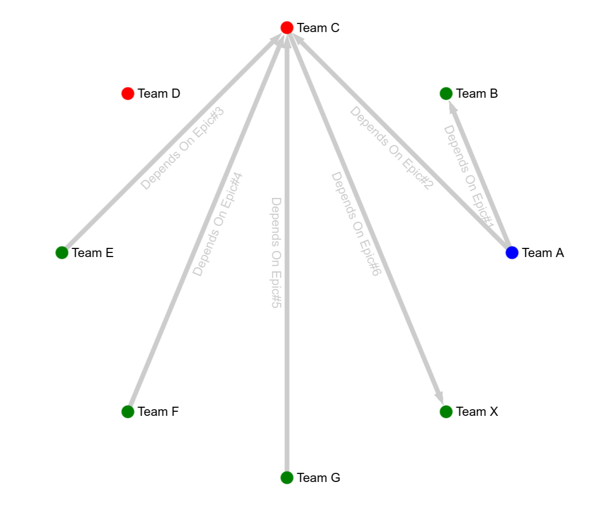

# Sigma-Graph-POC

Sigma-Graph-POC: Simple Graph of Dependencies POC wtih Sigma + Graphology + React
The idea is to make a graph of dependencies to easily visualize:
 * Bottlenecks
 * Teams without work
 * Critical Path
 * Priorization

### To Build
```bash
npm install
```
## To Run
```bash
npm run start 
```

## Result

